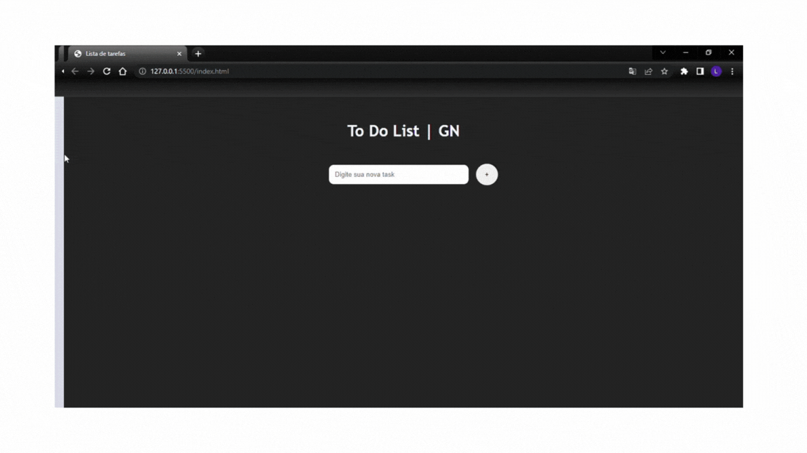

<h1 align="center">Lista de tarefas</h1>

<h5 align= "center">( https://contador-delta.vercel.app/)](https://lista-tarefas-rho.vercel.app/ )</h5>

<h2 align="center">
    Projeto de uma lista de tarefas utilizando as linguagens de marcação HTML e CSS, e a linguagem de programação Javascript. Ao entrar no projeto o usuário escreve quantas tarefas devem ser feitas, ao final do processo ele pode clicar no botão para listar cada tarefa que já foi realizada.
</h2>

<h2 align="center"> 
	Concluído 🟢
</h2>

<h2> 
	Demonstração do projeto
</h2>

<h2> 
	 🛠 Tecnologias
</h2>

As seguintes ferramentas foram usadas na construção do projeto:

- HTML
- CSS
- Javascript

## 👩🏻 Autora

Feito por Laís Martelini 👋 [Entre em contato!](https://www.linkedin.com/in/la%C3%ADs-martelini-12ab66226/)
